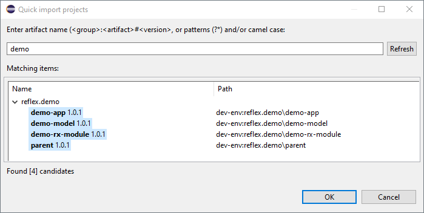

# Creating a _Hiconic Reflex_ Application

## Prerequisites

* Eclipse IDE **_(1)_**
* JDK 21+ installed with `JAVA_HOME` configured appropriately

**_(1)_** Sorry about that. While you currently need _Eclipse_ because of our own plugins (I know), we're already working on supporting all IDEs using standard tools (_Gradle_).

> ⚠️If you are new to _Eclipse_ make sure to change the _Java_ version to 21 in [preferences](https://stackoverflow.com/a/4881124/1696307) - under `Java` configure two things -  proper JDK under `Installed JREs`, and compiler level as 21 under `Compiler`.

## Preparing the Environment

We need to prepare the `devrock-sdk`, which is a folder that besides actual projects contains development tools, environment configuration and so on:

* Download [devrock-sdk.zip](https://api.hiconic-os.org/download-sdk.php)
* Unpack the `devrock-sdk` root folder from the zip
* Add `devrock-sdk/tools/jinni/bin` to your `PATH` environment variable
* Generate a [Personal Access Token (classic)](https://github.com/settings/tokens) with `read:packages` scope and copy its value (`ghp_AbcD3FGh1jK...`) to an environment variable `GITHUB_READ_PACKAGES_TOKEN`

Note that we have added two CLI tools to our path:

* _jinni_ - allows creation of new projects based on templates, among other things 
* _dr_ - is a simple wrapper for the underlying build tools - _Gradle_ and _Ant_ - to make things simpler

> We use the term `Devrock` as a brand name for our tooling, such as our build tools or _Eclipse_ plugins.

To verify the `PATH` is configured properly go to the command line and run:

```cli
jinni version
```

Expected output:
```
          °  ┌────┐
  ┌    ┌──┴───────┘
  └────┘        °
    °°
Jinni - version: 2.1.xyz
get help with: jinni help

DONE
```

> ⚠️On _Windows_, we have observed performance problems due to scanning the `devrock-sdk` directory. In such case consider adding this directory to the exception list in `Windows Security` / `Virus & threat protection`.

## Create a dev-env

_dev-env_ (which obviously stands for Development Environment) is a directory inside `devrock-sdk/env` which contains the code and configuration of your project, including an _Eclipse_ workspace.

> Having multiple _dev-envs_ is useful when working on multiple independent projects, but you can do all your work in just one.

Let's create a _dev-evn_ called `demo`.

On command line, navigate to `devrock-sdk/env`, end enter:
```cli
jinni create-dev-env demo
```

Expected folder structure:
```
demo/
  artifacts/    
  commands/
  eclipse-workspace/
  git/
  tf-setups/
```

* `artifacts` is a local _Maven_ repository, i.e. stores your own artifacts built locally and downloaded third party dependencies. The _Maven_ repositories are configured inside, in `repository-configuration.yaml`
* `commands` can be ignored
* `eclipse-workspace` is the workspace to open from _Eclipse_
* `git` would typically contain one or more _Git_ repository with our source code; in this example we will only create a repository folder, without initializing it as a _Git_ repository
* `tf-setups` can be ignored

## Creating a Group Directory

> Note we use the terms `artifact` and `group` as they are used by _Maven_.

_Hiconic_ uses a convention that all artifacts within a particular _group_ are placed inside a directory whose name is the _groupId_.

First, let's move inside `git`:
```cli
cd demo/git
```

Create a _group_ directory, say `reflex.demo`:

```cli
mkdir reflex.demo
```

Move inside:
```cli
cd reflex.demo
```

And initialize the group:
```cli
jinni create-group
```

This creates a _parent_ for the _group_ as well as _Gradle_ files used for building multiple artifacts at the same time. (Individual artifacts have their own ant scripts, for now). 

Expected folder structure (excluding files starting with '.'):
```
parent/
  build.xml
  pom.xml
build.gradle
buildscript.gradle
```

## Creating an Application

We can let _Jinni_ create a simple `hello-world` web application for us:
```cli
jinni create-reflex-project demo
```

This creates the following three artifacts:

* `demo-model` contains the request entities that make up our API. As an example, _Jinni_ creates one such request called `Greet`.
  ```java
  public interface Greet extends ServiceRequest {
    EntityType<Greet> T = EntityTypes.T(Greet.class);

    String getName();
    void setName(String name);
  }
  ```

* `demo-rx-module` contains the implementation of our API. As an example, _Jinni_ creates `GreetProcessor` to handle the `Greet` request. `DemoRxModuleSpace` then binds this processor to that request inside the `registerProcessors` method:

  ```java
	@Override
	public void configureMainServiceDomain(ServiceDomainConfiguration configuration) {
		configuration.register(Greet.T, greetProcessor());
	}
  ```
  > _Service Domain_ is a logical space with its own configuration, most notably mappings from requests to processors. In simple cases, we only work with the domain called `main`, but defining other domains is also possible (by implementing another method - `configureServiceDomains(...)`).

* `demo-app` defines our application as a bundle of the `reflex-platform`, our `demo-rx-module` and a module that provides a web server with a REST endpoint (`web-api-undertow-rx-module`).

  Note that this `web` endpoint is the default, but we could have also created a `CLI` application with `-e cli`, i.e.:
  ```cli
  jinni create-reflex-project demo -e cli
  ```


## Starting the Application from Command Line

To start the application from a command line we have to build it first. Call:
```cli
dr +range .
```

> This runs our build tool. `range` is the parameter specifying which artifacts we want to build and `.` is a special value that means everything.

> NOTE that downloading all the dependencies might take _Gradle_ a few minutes the very first time.

The previous step has, among other things, prepared launch scripts for our application. Let's navigate to:
```cli
cd demo-app/dist/application/bin
```

And call the `run` (or `run.bat`):
```
sh run
```

Our application should start at the default port `8080`.

To verify, open [http://localhost:8080/api/main/Greet?name=Someone](http://localhost:8080/api/main/Greet?name=Someone)

Your browser should display "Hello Someone".

## Installing Eclipse Plugins

In order to develop and run, we currently need _Eclipse_ plugins that manage your project's classpath and (especially for models) generate extra code and data used by our framework.

Follow these instruction in _Eclipse_:
* open `Help`/`Install New Software`
* click `Add...` to enter a new plugin repository
* **Name:** `Hiconic OS` \
**Location:** `https://eclipse.hiconic-os.org/beta`
* From the list of `devrock's features` select the following:\
`artifact-container` \
`artifact-reflection-builder` \
`main plugin` \
`model nature builder`


## Starting the Application from Eclipse

Let's now import our projects in _Eclipse_ and run the application (in debug mode) from there.

> Make sure to stop the application with `CTRL+C` if it's still running from the command line.

Let's open the _Eclipse_ workspace in our _dev-env_, located under `devrock-sdk/env/demo/eclipse-workspace`.

> If you're new to _Eclipse_ and the IDE has opened without you specifying a workspace, you need to click on `File` / `Switch Workspace` / `Other...` to select the workspace.

Now we need to import our artifacts. This is easy thanks to the _Devrock_ plugins, which are aware of our _dev-env_. They registered a shortcut - `CTRL` + `SHIFT` + `I` so press it, type `demo` and select all the artifacts:



> NOTE: If you now see **compilation errors**, select all these projects in workspace and refresh them (F5 or right click + refresh). This ensures the plugins build what's needed (demo model's artifact reflection).

Now, we want to run our application - `demo-app` - with the main class `RxPlatform`. For this there is a generated _Eclipse_ launch configuration. Expand the `demo-app` project, right click `demo-app.lauch` and click `Debug As` / `demo-app`.

To verify, once again, open [http://localhost:8080/api/main/Greet?name=Someone](http://localhost:8080/api/main/Greet?name=Someone)