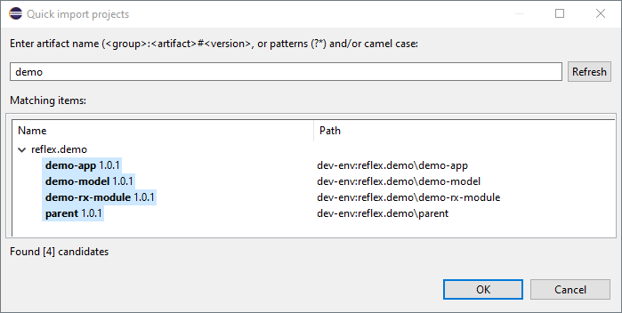

# Creating a _Hiconic Reflex_ Application

## Prerequisites

* Eclipse IDE **_(1)_**
* JDK 21+ installed with `JAVA_HOME` configured appropriately

**_(1)_** Sorry about that. While you currently need _Eclipse_ and our _Devrock_ plugins (I know), we are already working on supporting all IDEs using standard tools (_Gradle_).

## Preparing the Environment

We need to prepare the `devrock-sdk`, which is a directory that besides actual projects contains development tools, environment configuration and so on:

* Download [devrock-sdk.zip](https://api.hiconic-os.org/download-sdk.php)
* Unpack the `devrock-sdk` root folder from the zip
* Add `devrock-sdk/tools/jinni/bin` to your `PATH` environment variable
* Generate a [Personal Access Token (classic)](https://github.com/settings/tokens) with `read:packages` scope and copy its value (`ghp_AbcD3FGh1jK...`) to an environment variable `GITHUB_READ_PACKAGES_TOKEN`

Note that we have added two CLI tools to our path:

* _jinni_ - allows creation of new projects based on templates, among other things 
* _dr_ - is a simple wrapper for the underlying build scripts - _Gradle_ and _Ant_ - to make things simpler

To verify the `PATH` is configured properly go to the command line and run:

```cli
jinni version
```

Expected output:
```
          °  ┌────┐
  ┌    ┌──┴───────┘
  └────┘        °
    °°
Jinni - version: 2.1.xyz
get help with: jinni help

DONE
```

## Create a dev-env

_dev-env_ (which obviously stands for Development Environment) is a directory inside `devrock-sdk/env` which contains the code and configuration of your project, including an _Eclipse_ workspace.

> Having multiple _dev-envs_ is useful when working on multiple independent projects, but you can do all your work in just one _dev-env_.

Let's create a _dev-evn_ called `demo`.

On command line, navigate to `devrock-sdk/env`, end enter:
```cli
jinni create-dev-env demo
```

Expected folder structure:
```
demo/
  artifacts/    
  commands/
  eclipse-workspace/
  git/
  tf-setups/
```

* `artifacts` is a local maven repository, i.e. stores your own artifacts built locally and downloaded third party dependencies. The _Maven_ repositories are configured inside, in `repository-configuration.yaml`
* `commands` can be ignored
* `eclipse-workspace` is the workspace to open from _Eclipse_
* `git` would typically contain one or more _Git_ repository with our source code; in this example we will only create a repository folder, without initializing it as a _Git_ repository
* `tf-setups` can be ignored


## Installing Eclipse Plugins

We provide plugins that manage your project's classpath and (especially for models) generate extra code and data used by our framework.

Install these plugins in _Eclipse_:
* open `Help`/`Install New Software`
* click `Add...` to enter a new plugin repository
* **Name:** `Hiconic OS` \
**Location:** `https://eclipse.hiconic-os.org/beta`
* Select the following plugins:\
`artifact-container` \
`artifact-reflection-builder` \
`main plugin` \
`model nature builder`


## Creating a Group directory

> Note we use the terms `artifact` and `group` as they are used by _Maven_.

_Hiconic_ uses a convention that all artifacts within a particular _group_ are placed inside a directory whose name is the _groupId_.

First create a _group_ directory, say `reflex.demo`

```cli
mkdir reflex.demo
```

Move inside:
```cli
cd reflex.demo
```

And initialize the group:
```cli
jinni create-group
```

This creates a _parent_ for the _group_ as well as _Gradle_ files used for building multiple artifacts at the same time.

## Creating an Application

We can let _Jinni_ create a simple `hello-world` web application for us:
```cli
jinni create-reflex-project demo
```

This creates the following three artifacts for us:

* `demo-model` contains our request entities (and thus defines our API). As an example, _Jinni_ has created one such request called `Greet`.

* `demo-rx-module` contains the implementation of our API. As an example, _Jinni_ has create a `GreetProcessor`, which can handle the `Greet` request. `DemoRxModuleSpace` then binds this processor to that request inside the `registerProcessors` method:

  ```java
  @Override
  public void registerProcessors(ConfigurableDispatchingServiceProcessor dispatching) {
  	dispatching.register(Greet.T, greetProcessor());
  }
  ```

* `demo-app` defines our application as bundle of the `reflex-platform`, our module and a web endpoint module `web-api-undertow-rx-module`.

  Note that this `web` endpoint is the default, but we could have also created a CLI application via:
  ```cli
  jinni create-reflex-project demo -e cli
  ```


### Starting the Application from Command Line

To start the application from a command line we have to build it first. Call:
```cli
dr +range .
```

> This runs the `devrock` build tool. `range` is the parameter specifying which artifacts we want to build and the value `.` is a special character that means everything.

The previous step has, among other things, prepared launch scripts for our application. Let's navigate to:
```cli
cd demo-app/dist/application/bin
```

And call the `run` (or `run.bat`):
```
sh run
```

Our application should start at the default port `8080`.

To verify, open [http://localhost:8080/api/main/Greet?name=John](http://localhost:8080/api/main/Greet?name=John)

Your browser should display "Hello John".


### Starting the Application from Eclipse

Let's now import our projects in _Eclipse_ and run the application (in debug mode) from there.

> Make sure to stop the application with CTRL+C if it's running from the command line.

Let's open the _Eclipse_ workspace in our _dev-env_, located under `devrock-sdk/env/demo/eclipse-workspace`.

> If you're new to _Eclipse_ and the IDE has opened without you specifying a workspace, you need to click on `File` / `Switch Workspace` / `Other` to select the workspace.

Now we need to import our artifacts. This is easy thanks to the _Devrock_ plugins, which are aware of our _dev-env_. They registered a shortcut - `CTRL` + `SHIFT` + `I`,type `demo` and select all the artifacts:



> NOTE: If you now see **compilation errors**, select all these projects in workspace and refresh them (F5 or right click + refresh). This ensures the plugins build what's needed (demo model's artifact reflection).

Now, we want to run our application - `demo-app` - with the main class `RxPlatform`. For this there is a generated _Eclipse_ launch configuration. Expand the `demo-app` project, right click `demo-app.lauch` and click `Debug As` / `demo-app`.


